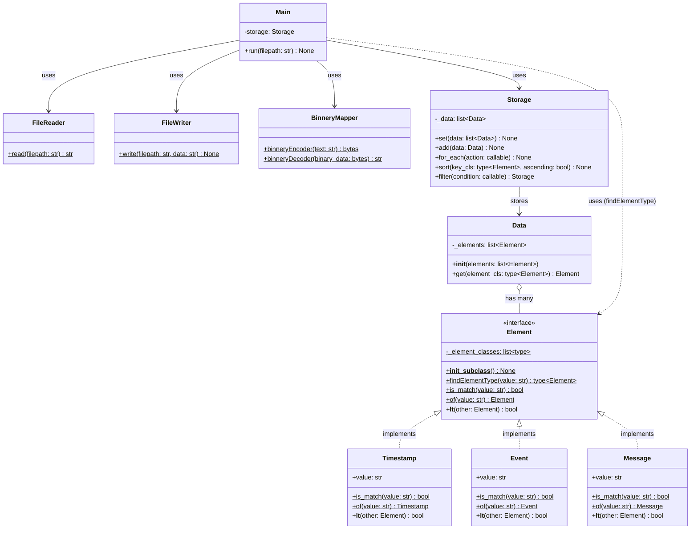

# Class Documentation

## 클래스별 책임

### FileReader
- **책임** : 파일을 읽어 `str` 형태 문자열로 반환
- static 방식으로 동작하는 유틸리티 클래스

### FileWriter
- **책임** : 가공된 단일 문자열(`str`)을 지정된 파일에 기록
- static 방식으로 동작하는 유틸리티 클래스

### Element (Interface)
각각의 요소를 담당함
- sort를 위한 순위 비교 함수
- 생성을 위한 함수

구현체 들을 static 변수에 저장하고 관리함

### Timestamp, Event, Message (구현체)
Element를 구현

### Data
- **책임** : 로그 한 줄을 저장하는 entity 클래스
- 여러개의 Element를 가짐
- Element별 get 함수 제공

### Storage
- **책임** : Data를 메모리에 저장·관리
- set, add, for_each 함수 제공 
- 제네릭 처리
- sort, filter 기능 구현

### BinneryMapper
- **책임** : 문자열과 이진수(binary bytes) 간의 인코딩/디코딩 변환
- binneryEncoder, binneryDecoder 정적 메서드 제공

### Main
- **책임** : FileReader와 Storage를 조합하여 실행 흐름 제어
1. log 파일을 FileReader로 읽음
2. 첫줄을 읽어서 ElementType을 확인하고 Storage를 생성
3. 나머지 log들을 모두 Data로 변환, Storage에 저장

## 클래스 다이어그램

